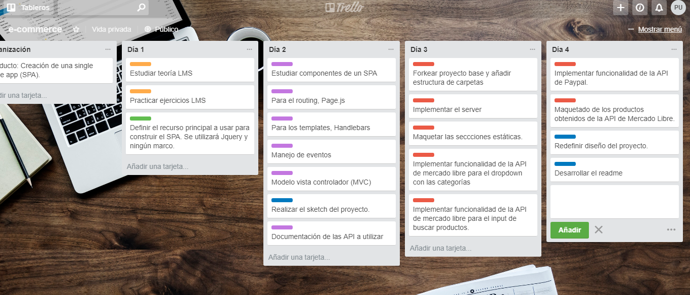
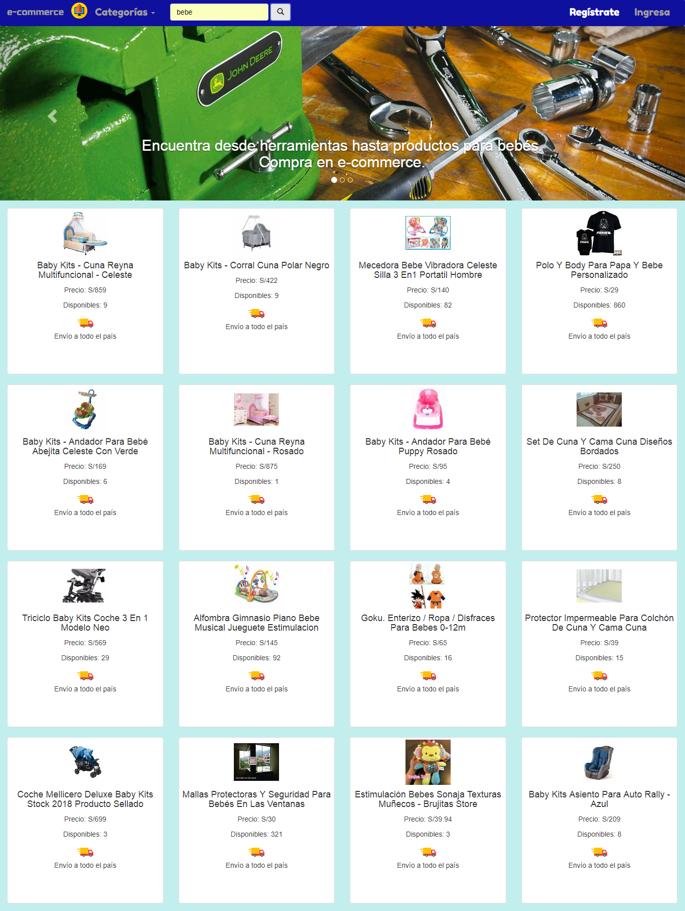
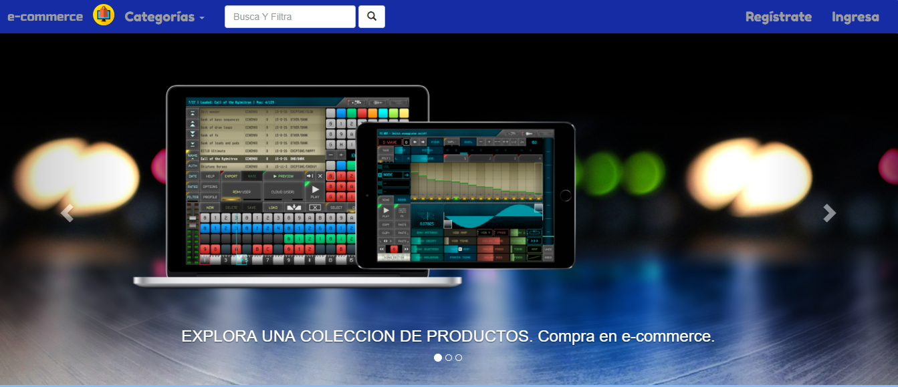
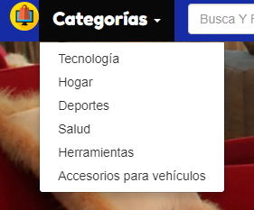
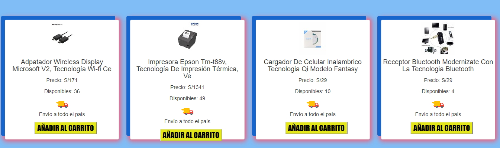
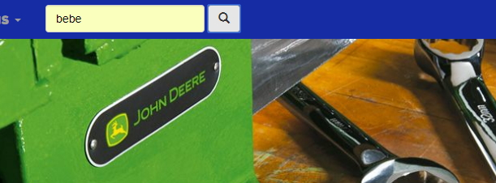
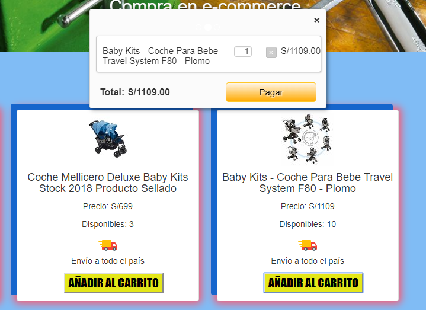
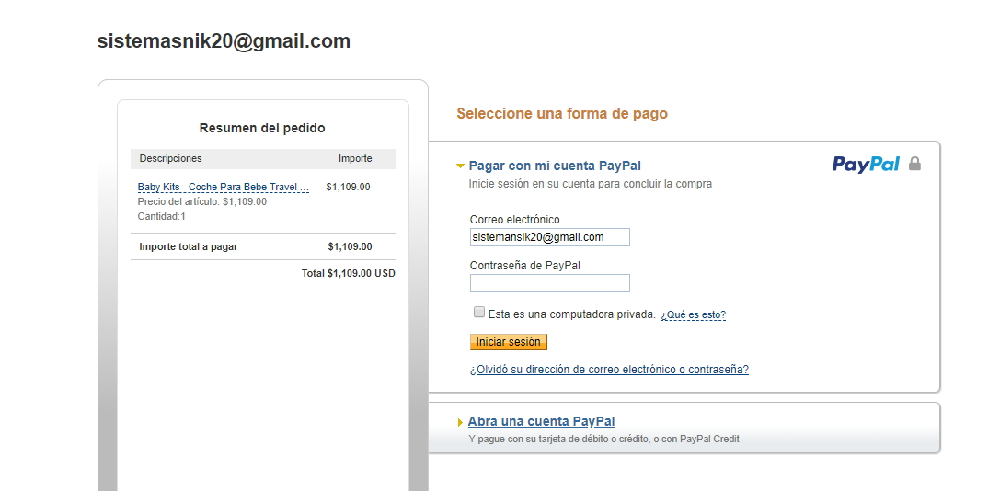

# E-commerce

## Descripción:

+ E-commerce es una aplicación web que permite la compra de productos y utiliza las API de Mercado Libre y PayPal para interactuar con sus fuentes de datos.

## Objetivo:

+ Crear una Single Page App (SPA), que básicamente es un tipo de aplicación web donde todas las pantallas se muestran en la misma página, sin recargar el navegador.

## Planificación:

+ Nos organizamos haciendo uso de trello, aquí el [link](https://trello.com/b/Bhkol7h7/e-commerce "link").

## Vista desktop de la aplicación web:

_____________________________________________________________________________________________________________________

_____________________________________________________________________________________________________________________
+ La busqueda se puede realizar a travez de las opciones que te dan en categorias

_____________________________________________________________________________________________________________________
+ Se muestran los productos de acuerdo a la opcion elegida (EJEMPLO DE PRODUCTOS TECNOLOGICOS)

_____________________________________________________________________________________________________________________
+ La busqueda tambien se puede realizar a travez del input a la vez poder filtra lo que desees

_____________________________________________________________________________________________________________________
+ Mostramos un boton para añadir al carrito y realizar la compra respectiva

_____________________________________________________________________________________________________________________
+ Se le muestra un resumen con todos los productos a comprar y se le direcciona a paypal para hacer la respectiva compra.

_____________________________________________________________________________________________________________________

## Herramientas:

+ Jquery.
+ API de mercado libre.
+ API de Paypal.
+ Page.js, que es un manejador de rutas en javascript desde el lado del front-end.
+ Handlebars (plantillas). Como su nombre lo dice es un sistema de plantillas y será necesario implementarlo en nuestro proyecto.
+ HTML5.
+ minicart.js
+ CSS3.

## Créditos:

+ Nefeli Joñoruco.
+ Patricia Urco.
